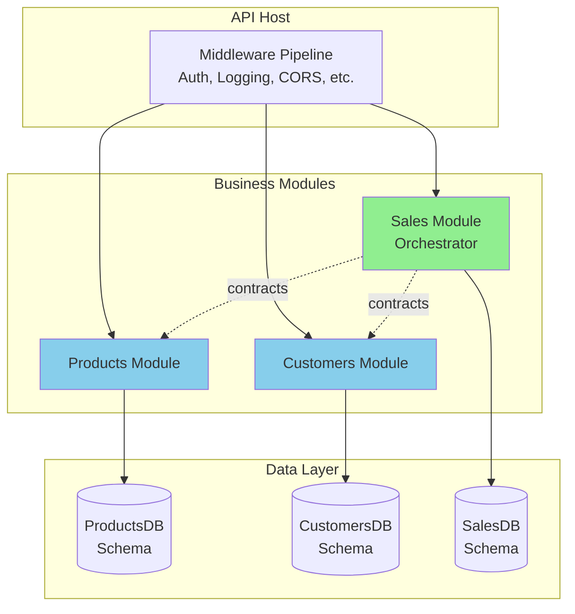
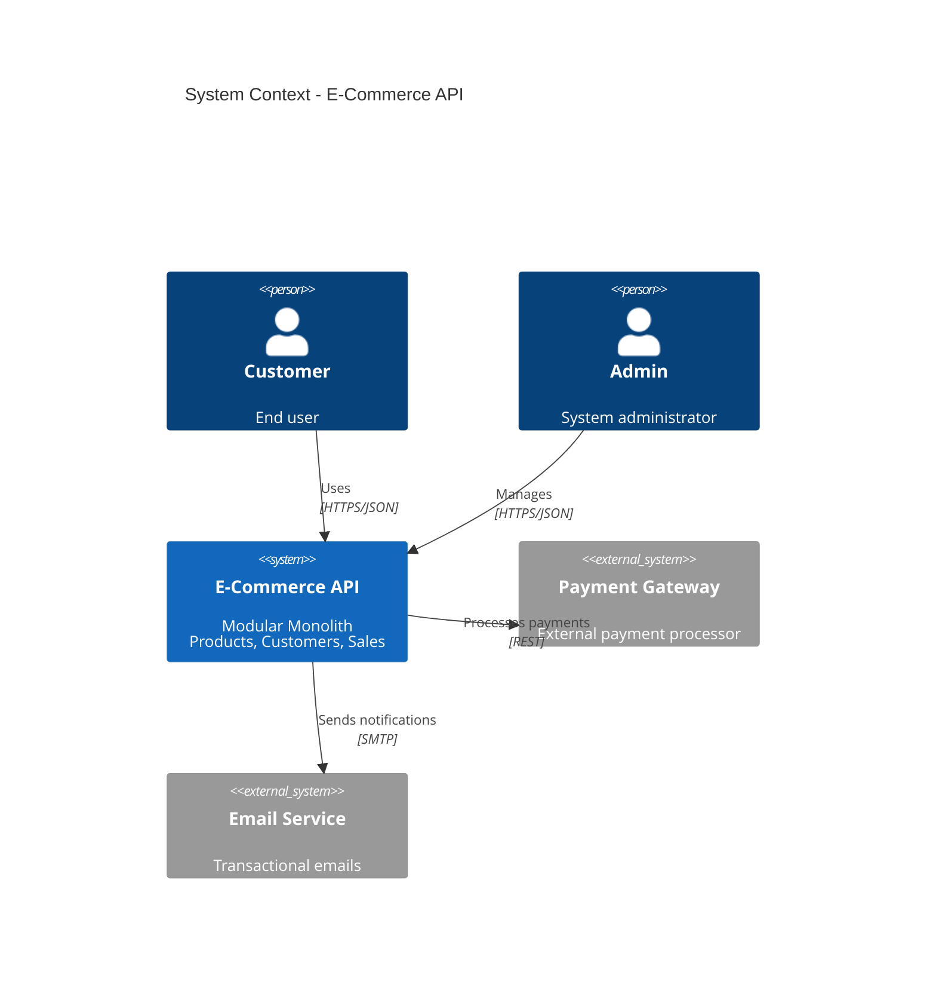
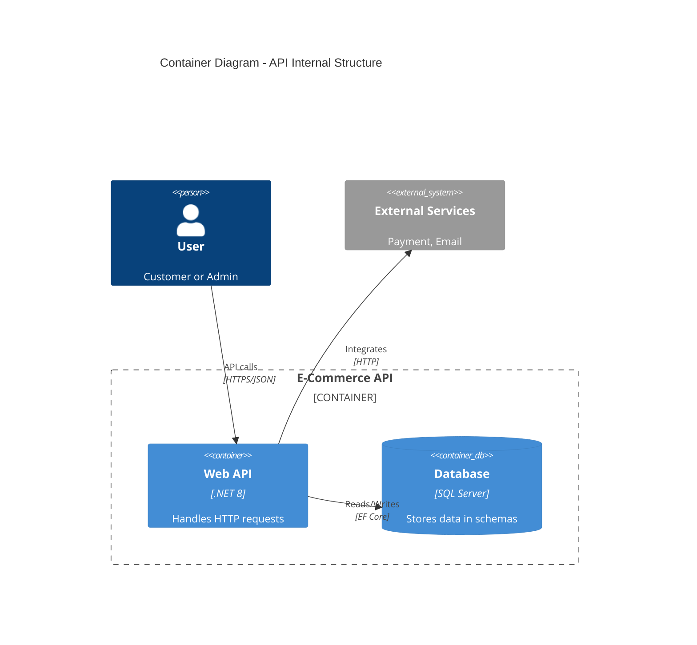
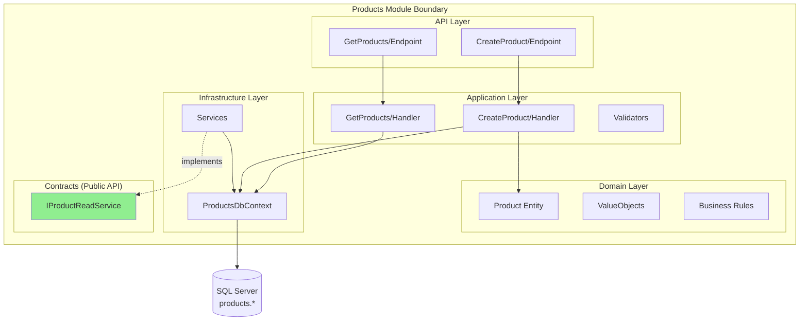
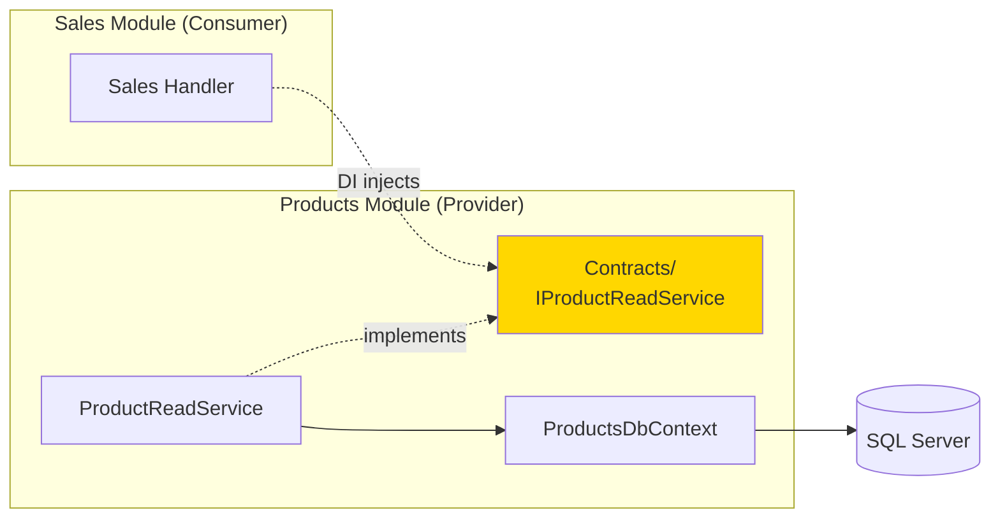
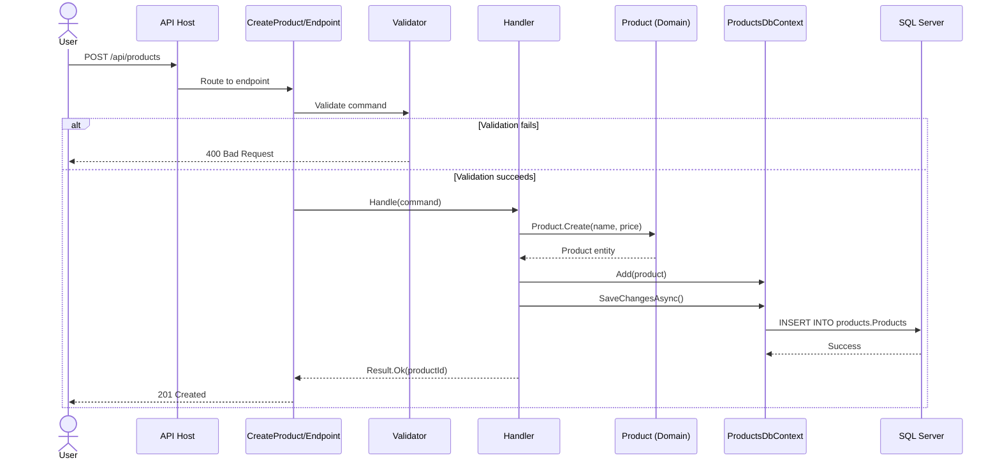
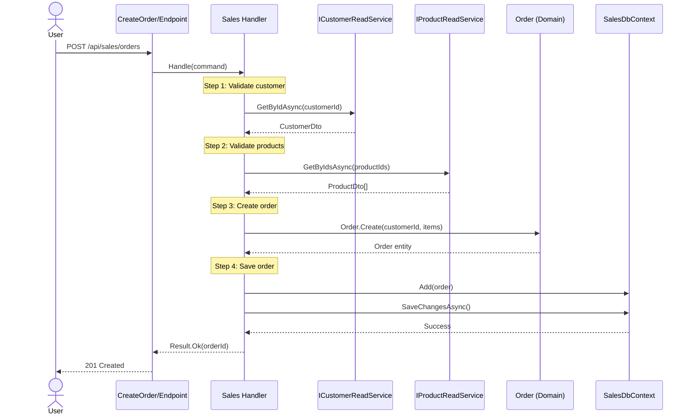
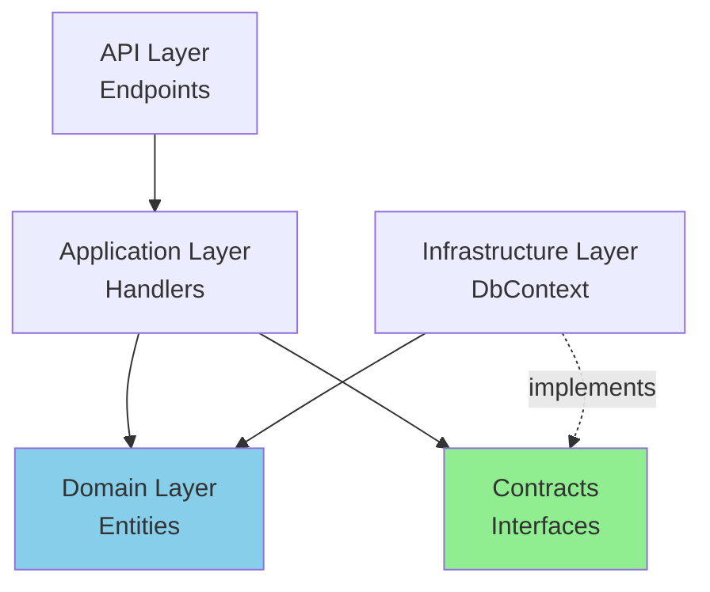

# 🏗️ .NET API Templates - Modular Monolith Architecture

[](https://dotnet.microsoft.com/)
[](LICENSE)
[](docs/architecture.md)

Enterprise-grade .NET API templates using **Modular Monolith** with **Vertical Slice Architecture**. Built for simplicity, scalability, and clean architecture principles.

---

## 📋 Table of Contents

- [Overview](#-overview)
- [Architecture](#-architecture)
- [Quick Start](#-quick-start)
- [Templates](#-templates)
- [Documentation](#-documentation)
- [Examples](#-examples)
- [Contributing](#-contributing)

---

## 🎯 Overview

This repository provides production-ready .NET API templates for building modular, maintainable, and scalable applications.

### Key Features

✅ **Simple yet Powerful** - Easy to start, scales to 500K+ lines of code  
✅ **Modular Monolith** - Clear boundaries, single deployment  
✅ **Vertical Slice Architecture** - Features organized by use case, not technical layers  
✅ **Clean Architecture** - Domain-driven design with proper separation of concerns  
✅ **Cross-Cutting Built-in** - Auth, logging, observability, validation, error handling  
✅ **Evolutive Design** - Start simple, evolve to microservices when needed  
✅ **Test-Ready** - Unit, integration, and architecture tests included  

### When to Use

- ✅ Small to medium teams (2-15 developers)
- ✅ Applications with 3-10 bounded contexts
- ✅ Need for transactional consistency
- ✅ Prioritize deployment simplicity over distributed complexity
- ✅ Unsure if microservices will be needed (keep options open)

---

## 🏛️ Architecture

### Architecture Style

**Modular Monolith + Vertical Slice Architecture + Clean Architecture**



### System Context Diagram (C4 Model)



### Container Diagram (C4 Model)



---

## 🚀 Quick Start

### Prerequisites

- [.NET 8 SDK](https://dotnet.microsoft.com/download/dotnet/8.0)
- [SQL Server](https://www.microsoft.com/en-us/sql-server/sql-server-downloads) or [PostgreSQL](https://www.postgresql.org/)
- [Docker](https://www.docker.com/) (optional, for containerized development)

### Installation

```bash
# Clone the repository
git clone https://github.com/cmargok/templates.git
cd templates

# Install the template
dotnet new install ./ModularMonolith

# Create a new project
dotnet new modular-api -n MyCompany.ECommerce -o ./MyCompany.ECommerce

# Navigate to the project
cd MyCompany.ECommerce

# Restore dependencies
dotnet restore

# Update database
dotnet ef database update --project src/Api

# Run the application
dotnet run --project src/Api
```

Navigate to `https://localhost:5001/swagger` to see the API documentation.

---

## 📦 Templates

### 1. Modular Monolith (Full Template)

**Path:** `ModularMonolith/`

For medium to large applications with multiple bounded contexts.

**Structure:**
```
src/Api/
├─ Modules/
│  ├─ Products/
│  ├─ Customers/
│  └─ Sales/
├─ Common/
└─ Configuration/
```

**Use cases:**
- E-commerce platforms
- CRM/ERP systems
- Multi-tenant SaaS

---

### 2. Micro API (Lightweight Template)

**Path:** `MicroApi/`

For simple APIs, background jobs, webhooks, or adapters.

**Structure:**
```
src/MicroApi/
├─ Features/
├─ Infrastructure/
└─ Domain/
```

**Use cases:**
- Batch processing (image processing, data imports)
- Webhook handlers
- API adapters/proxies
- Scheduled jobs

---

## 📖 Documentation

### Architecture Documentation

#### Folder Structure

```
src/Api/
│
├─ Program.cs                          # Application entry point
├─ appsettings.json                    # Configuration
│
├─ Configuration/                      # Cross-cutting setup
│  ├─ AuthConfiguration.cs
│  ├─ DatabaseConfiguration.cs
│  ├─ ObservabilityConfiguration.cs
│  └─ SecurityConfiguration.cs
│
├─ Middleware/                         # Cross-cutting concerns
│  ├─ CorrelationIdMiddleware.cs
│  ├─ ExceptionHandlingMiddleware.cs
│  └─ IdempotencyMiddleware.cs
│
├─ Common/                             # Shared building blocks
│  ├─ Abstractions/
│  │  ├─ Result.cs
│  │  ├─ ICommand.cs
│  │  └─ IQuery.cs
│  ├─ Guards/
│  └─ Extensions/
│
└─ Modules/                            # Business modules
   │
   ├─ Products/
   │  ├─ ProductsModule.cs             # DI + endpoint registration
   │  │
   │  ├─ Features/                     # Vertical slices
   │  │  ├─ CreateProduct/
   │  │  │  ├─ Endpoint.cs             # HTTP route
   │  │  │  ├─ Command.cs              # Request DTO
   │  │  │  ├─ Response.cs             # Response DTO
   │  │  │  ├─ Handler.cs              # Application logic
   │  │  │  └─ Validator.cs            # FluentValidation
   │  │  ├─ GetProducts/
   │  │  └─ UpdateStock/
   │  │
   │  ├─ Domain/                       # Business logic
   │  │  ├─ Entities/
   │  │  │  └─ Product.cs
   │  │  ├─ ValueObjects/
   │  │  └─ Events/
   │  │
   │  ├─ Infrastructure/               # Technical details
   │  │  ├─ Persistence/
   │  │  │  ├─ ProductsDbContext.cs
   │  │  │  ├─ Configurations/
   │  │  │  └─ Migrations/
   │  │  └─ Services/
   │  │     └─ ProductReadService.cs
   │  │
   │  └─ Contracts/                    # Public module API
   │     ├─ Read/
   │     │  ├─ IProductReadService.cs
   │     │  └─ ProductDto.cs
   │     └─ Commands/
   │        └─ IInventoryService.cs
   │
   ├─ Customers/                       # Same structure
   │
   └─ Sales/                           # Orchestrator module
      ├─ Features/
      │  └─ CreateOrder/
      │     └─ Handler.cs              # Uses ICustomerReadService + IProductReadService
      ├─ Domain/
      └─ Infrastructure/
```

---

### Component Structure



---

### Cross-Module Communication



**Rules:**
- ✅ Modules communicate via **Contracts** (interfaces)
- ❌ Modules CANNOT access other modules' DbContext directly
- ✅ Synchronous in-process calls via Dependency Injection
- ⚠️ Asynchronous via Domain Events (Outbox pattern) when eventual consistency is acceptable

---

### Sequence Diagrams

#### Simple Flow: Create Product



#### Orchestration Flow: Create Order (Cross-Module)



---

### Dependency Rules



**Rules:**
- ✅ **Domain** has NO dependencies (pure business logic)
- ✅ **Application** depends on Domain + Contracts
- ✅ **Infrastructure** depends on Domain, implements Contracts
- ✅ **API** depends on Application
- ❌ **Domain** CANNOT depend on Infrastructure
- ❌ **Application** CANNOT depend on Infrastructure directly

---

## 📚 Examples

### Example 1: Simple CRUD Module (Products)

```bash
# Already included in the template
dotnet run --project src/Api

# Test endpoints
curl -X POST https://localhost:5001/api/products \
  -H "Content-Type: application/json" \
  -d '{"name": "Laptop", "price": 1500}'

curl https://localhost:5001/api/products
```

### Example 2: Orchestration Module (Sales)

```bash
# Create an order (orchestrates Customers + Products)
curl -X POST https://localhost:5001/api/sales/orders \
  -H "Content-Type: application/json" \
  -d '{
    "customerId": "abc-123",
    "items": [
      {"productId": "prod-1", "quantity": 2},
      {"productId": "prod-2", "quantity": 1}
    ]
  }'
```

### Example 3: Lightweight Batch Processing (Micro API)

See `MicroApi/` template for image processing example:
- Fetch images from external API
- Generate ZIP file
- Call processing API
- Log transaction to database

---

## 🧪 Testing

### Architecture Tests (NetArchTest)

```csharp
[Fact]
public void Domain_Should_NotHave_DependencyOn_Infrastructure()
{
    var result = Types.InAssembly(typeof(Product).Assembly)
        .That().ResideInNamespace("Domain")
        .ShouldNot().HaveDependencyOn("Infrastructure")
        .GetResult();

    Assert.True(result.IsSuccessful);
}
```

### Integration Tests (WebApplicationFactory)

```csharp
public class CreateProductTests : IClassFixture<WebApplicationFactory<Program>>
{
    [Fact]
    public async Task CreateProduct_ReturnsCreated()
    {
        // Arrange
        var client = _factory.CreateClient();
        var command = new { name = "Laptop", price = 1500 };

        // Act
        var response = await client.PostAsJsonAsync("/api/products", command);

        // Assert
        Assert.Equal(HttpStatusCode.Created, response.StatusCode);
    }
}
```

---

## 🛠️ Built With

- [.NET 8](https://dotnet.microsoft.com/) - Framework
- [EF Core 8](https://docs.microsoft.com/en-us/ef/core/) - ORM
- [FluentValidation](https://fluentvalidation.net/) - Validation
- [Serilog](https://serilog.net/) - Logging
- [Polly](https://github.com/App-vNext/Polly) - Resilience (Retry, Circuit Breaker)
- [Swashbuckle](https://github.com/domaindrivendev/Swashbuckle.AspNetCore) - OpenAPI/Swagger
- [NetArchTest](https://github.com/BenMorris/NetArchTest) - Architecture testing

---

## 🗺️ Roadmap

### Phase 1: Core Templates ✅
- [x] Modular Monolith template
- [x] Micro API template
- [x] Documentation with diagrams

### Phase 2: Advanced Features 🚧
- [ ] CQRS with MediatR (optional)
- [ ] Event-driven communication (Outbox pattern)
- [ ] Multi-tenancy support
- [ ] API Gateway integration example

### Phase 3: DevOps & Observability 📋
- [ ] Docker Compose for local development
- [ ] Kubernetes manifests
- [ ] GitHub Actions CI/CD pipelines
- [ ] OpenTelemetry distributed tracing

### Phase 4: Additional Templates 📋
- [ ] gRPC services template
- [ ] Background worker template (Hangfire/Quartz)
- [ ] GraphQL API template

---

## 📄 Architecture Decision Records (ADRs)

### ADR-001: Modular Monolith over Microservices

**Status:** Accepted  
**Context:** Need scalable architecture with clear domain boundaries.  
**Decision:** Use Modular Monolith with Vertical Slice Architecture.  
**Consequences:**
- ✅ Simple deployment and operations
- ✅ Transactional consistency
- ✅ Fast development velocity
- ⚠️ Requires discipline to maintain boundaries
- 🔄 Can evolve to microservices when needed

### ADR-002: Single Database with Schema-per-Module

**Status:** Accepted  
**Context:** Need data isolation while maintaining simplicity.  
**Decision:** Single SQL Server with separate schemas per module.  
**Consequences:**
- ✅ Logical isolation
- ✅ Single backup/restore
- ✅ Each module has separate DbContext
- ⚠️ Requires discipline (no cross-schema JOINs)

### ADR-003: Synchronous Inter-Module Communication

**Status:** Accepted  
**Context:** Sales module needs data from Products/Customers.  
**Decision:** Synchronous in-process calls via Contracts (DI).  
**Consequences:**
- ✅ Simple, fast, type-safe
- ⚠️ Tight temporal coupling
- 🔄 Can add async events later for eventual consistency

### ADR-004: Vertical Slice Architecture per Feature

**Status:** Accepted  
**Context:** Reduce cognitive load, improve maintainability.  
**Decision:** Organize by feature, not technical layers.  
**Consequences:**
- ✅ High cohesion
- ✅ Easy to find/modify/delete features
- ⚠️ Slight duplication (acceptable trade-off)

---

## 🤝 Contributing

Contributions are welcome! Please read [CONTRIBUTING.md](CONTRIBUTING.md) for details.

### Development Setup

```bash
# Clone the repo
git clone https://github.com/cmargok/templates.git
cd templates

# Create a feature branch
git checkout -b feature/my-feature

# Make changes and test
dotnet test

# Commit and push
git commit -m "Add my feature"
git push origin feature/my-feature
```

---

## 📝 License

This project is licensed under the MIT License - see the [LICENSE](LICENSE) file for details.

---

## 👥 Authors

- **Kevin Camargo** - [@cmargok](https://github.com/cmargok)

---

## 🙏 Acknowledgments

- Inspired by [Clean Architecture](https://blog.cleancoder.com/uncle-bob/2012/08/13/the-clean-architecture.html) by Robert C. Martin
- [Vertical Slice Architecture](https://www.jimmybogard.com/vertical-slice-architecture/) by Jimmy Bogard
- [Modular Monolith](https://www.kamilgrzybek.com/blog/posts/modular-monolith-primer) by Kamil Grzybek
- [C4 Model](https://c4model.com/) by Simon Brown

---


<div align="center">

**Made with ❤️ for the .NET community**

[⬆ Back to Top](#️-net-api-templates---modular-monolith-architecture)

</div>